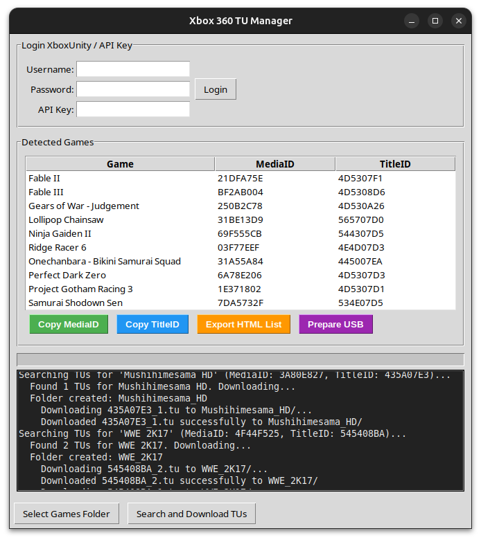

# X360 TU Manager

[](https://github.com/Wamphyre/X360-TU-Manager)
[](https://python.org)
[](https://github.com/Wamphyre/X360-TU-Manager/blob/main/LICENSE)

**X360 TU Manager** is a Python GUI tool for **managing and downloading Title Updates (TUs)** for Xbox 360 games from [XboxUnity](https://xboxunity.net), using each game's **MediaID** and **TitleID**.

## ✨ Features

- 🎮 **Automatic game detection** from folders containing Xbox 360 games
 - �️ **Integrated ZIP/ISO extraction** - extract game folders or ISO files directly from archives inside the app (new)
- �🔍 **MediaID and TitleID extraction** using XexTool from default.xex files
- 🌐 **XboxUnity integration** with API Key or username/password authentication
- 📥 **Smart TU downloading** with original filenames from XboxUnity servers
- 🎯 **MediaID filtering** - only downloads TUs that match your exact game version
- 📁 **Organized folder structure** - downloads TUs into game-named folders
- 📋 **Quick copy functions** for MediaID and TitleID to clipboard
- 📄 **HTML export** - generate a complete game catalog for inventory control and management
- 💾 **Advanced USB preparation** - automatic TU type detection (Cache vs Content)
- 🔄 **Dual TU support** - handles both uppercase (Cache) and lowercase (Content) formats
- 🌐 **Direct FTP upload** - upload TUs directly to Xbox 360 via FTP (no USB needed)
- 📊 **Progress tracking** with detailed logs and statistics

## 📸 Screenshot



---

## ☕ Support the Project

If you find X360 TU Manager useful, consider supporting its development:

[](https://ko-fi.com/wamphyre94078)

Your support helps maintain and improve this tool for the Xbox 360 community! 🎮

---

## 📦 Requirements

- **Python 3.8+** (tested on 3.10 and 3.11)
- **Wine** (on Linux/macOS, automatically detected - to run `XexTool.exe`)
- **XboxUnity account** or API Key
- Python dependencies:
  ```bash
  pip install requests tkinter
  ```
 - System tools for archive extraction (recommended):
    - **ZIP**: handled by Python's built-in libraries (no extra install required)
    - **ISO**: for reliable ISO extraction, install **7-Zip** (Windows) or **p7zip/bsdtar** (Linux/macOS)

### 🖥️ Cross-Platform Support
- **Windows**: Runs XexTool.exe natively (no Wine needed)
- **Linux**: Automatically uses Wine to run XexTool.exe
- **macOS**: Automatically uses Wine to run XexTool.exe

---

## 🚀 Installation

1. **Clone the repository**:
   ```bash
   git clone https://github.com/Wamphyre/X360-TU-Manager.git
   cd X360-TU-Manager
   ```
2. **Install Python dependencies**:
   ```bash
   pip install requests
   ```
3. **Install Wine** (Linux/macOS only - automatically detected):
   ```bash
   # Ubuntu/Debian
   sudo apt install wine

   # Arch Linux
   sudo pacman -S wine

   # macOS (using Homebrew)
   brew install wine-stable
   ```
4. **Ensure XexTool.exe** is in the `xextool/` folder (included in repository)

---

## 🎯 How to Use

### Step 1: Setup
1. **Launch the application**:
   ```bash
   python3 main.py
   ```
2. **Configure XboxUnity authentication**:
   - **Option A**: Enter your XboxUnity **API Key** (recommended)
   - **Option B**: Enter your XboxUnity **username and password**
3. **Configure Xbox 360 FTP** (optional, for direct upload):
   - **Xbox IP**: Your Xbox 360's IP address
   - **FTP User**: FTP username (leave empty for anonymous)
   - **FTP Pass**: FTP password (leave empty for anonymous)
   - **Click "Test FTP"** to verify connection
4. **Click "Login"** to authenticate with XboxUnity

### Step 1.5 (Optional): Extract ZIP/ISO archives
This step is completely optional — only use it if your games are stored inside ZIP or ISO archives. If your games are already extracted in folders, skip this step and continue to Step 2 (Detect Games).
1. **Click "Extract Archive"** in the application (or drag-and-drop supported archive files/folders)
2. **Select a ZIP or ISO file**, or a folder containing archives
3. **Choose extraction destination** (the app can extract into the same parent folder or a chosen directory)
4. **Wait for extraction** - if you chose to run this optional step, the tool will:
   - Automatically detect archive type (ZIP or ISO)
   - For ZIP: extract file/folder contents directly
   - For ISO: extract files using available system tools (Python built-ins where possible, otherwise call system 7-Zip/p7zip if installed)

### Step 2: Detect Games
1. **Click "Select Games Folder"**
2. **Choose the folder** containing your Xbox 360 games
   - Each game should be in its own subfolder
   - Each game folder must contain a `default.xex` file
3. **Wait for detection** - the tool will automatically:
   - Scan all subfolders for `default.xex` files
   - Extract MediaID and TitleID from each game
   - Display results in the games list

### Step 3: Download Title Updates
1. **Click "Search and Download TUs"**
2. **Select destination folder** where TUs will be saved
3. **Wait for processing** - the tool will:
   - Search XboxUnity for each game's TUs
   - Filter TUs to match your specific MediaID
   - Download TUs into organized folders (one per game)
   - Show progress and detailed logs

### Step 4: Additional Features

#### 📋 Copy Game Information
- **Select any game** from the list
- **Click "Copy MediaID"** or **"Copy TitleID"** to copy to clipboard
- **Right-click** on any game for context menu options

#### 📄 Export Game Catalog
- **Click "Export HTML List"** to generate a complete game catalog
- **Choose save location** for the HTML file
- **Open in browser** to view your complete game inventory with search functionality
- **Perfect for inventory control** - keep track of all your Xbox 360 games in one organized catalog
- **Easy game management** - search, filter, and copy game information as needed

#### 💾 Prepare USB for Xbox 360
1. **Click "Prepare USB"** after downloading TUs
2. **Select the folder** where you downloaded the TUs
3. **Wait for USB structure creation** - automatically detects TU types and creates proper structure:

   **For Content TUs** (lowercase format like `tu00000005_00000000`):
   ```
   USB_Xbox360/
   └── Content/
       └── 0000000000000000/
           └── [TitleID]/
               └── 000B0000/
                   └── tu00000005_00000000
   ```

   **For Cache TUs** (uppercase format like `TU_16L61V6_0000014000000.00000000000O9`):
   ```
   USB_Xbox360/
   └── Cache/
       └── TU_16L61V6_0000014000000.00000000000O9
   ```

4. **Copy both "Content" and "Cache" folders** to the root of your USB drive
5. **Connect USB to Xbox 360** and install TUs from System Settings > Memory or use Aurora

#### 🌐 Upload Directly to Xbox 360 (FTP)
1. **Configure FTP settings** in the Xbox 360 FTP Connection panel
2. **Enable FTP on Xbox 360** (Aurora FTP plugin recommended)
3. **Click "Upload to Xbox"** after downloading TUs
4. **Select TUs folder** - works with individual files or USB_Xbox360 structure
5. **Wait for upload** - TUs are automatically placed in correct directories:
   - Cache TUs → `/Hdd1/Cache/`
   - Content TUs → `/Hdd1/Content/0000000000000000/[TitleID]/000B0000/`
6. **TUs are immediately available** in Aurora without restart

---

## 🔧 Technical Details

### How It Works
1. **Game Detection**: Scans folders for `default.xex` files using XexTool
2. **ID Extraction**: Extracts MediaID and TitleID from XEX headers
3. **XboxUnity API**: Uses real endpoint `TitleUpdateInfo.php` discovered through web analysis
4. **Smart Filtering**: Only downloads TUs matching your exact MediaID to ensure compatibility
5. **Original Filenames**: Downloads TUs with their original names from XboxUnity servers
6. **Automatic TU Classification**: Detects TU type (Cache vs Content) based on filename format
7. **Organized Storage**: Creates game-named folders and proper Xbox 360 directory structure

### Supported Formats
- **Input**: Xbox 360 games with `default.xex` files
- **Output**: Original TU files with proper Xbox 360 naming conventions
  - **Cache TUs**: Uppercase format (e.g., `TU_16L61V6_0000014000000.00000000000O9`)
  - **Content TUs**: Lowercase format (e.g., `tu00000005_00000000`)
- **Export**: HTML game catalog for inventory control and collection management
 - **Archives**: ZIP archives containing game folders or files, ISO images containing Xbox 360 game file systems (ISO extraction supported when system tools available)

### MediaID vs TitleID
- **MediaID**: Unique identifier for your specific game disc/version
- **TitleID**: Game identifier (same for all versions of a game)
- **Why MediaID matters**: Ensures TU compatibility with your exact game version

### TU Types and Installation
- **Cache TUs** (uppercase): Go directly in Xbox 360's `Cache/` folder
- **Content TUs** (lowercase): Go in `Content/0000000000000000/[TitleID]/000B0000/` structure
- **Automatic Detection**: Tool automatically determines correct placement based on filename format

### FTP Upload Features
- **Direct Xbox 360 connection** via Aurora FTP plugin
- **Automatic directory creation** - creates required folder structure
- **Smart file placement** - Cache and Content TUs go to correct locations
- **No USB required** - upload directly over network
- **Immediate availability** - TUs ready to use in Aurora instantly

---

## 🛠️ Troubleshooting

### Common Issues

**"XexTool.exe not found"**
- Ensure `XexTool.exe` is in the `xextool/` folder
- On Linux, make sure Wine is installed

**"Cannot connect to XboxUnity"**
- Check your internet connection
- Verify your API Key or login credentials
- XboxUnity might be temporarily down

**"No games detected"**
- Ensure each game folder contains a `default.xex` file
- Check that you selected the correct parent folder
- Verify XexTool can read the XEX files

**"No TUs found"**
- Not all games have Title Updates available
- Some games might not be in XboxUnity's database
- Check the logs for detailed information

**"FTP connection failed"**
**"Archive extraction failed"**
- Ensure the archive file is not corrupted and is a standard ZIP or ISO
- For ZIP: the app uses Python's zipfile module and may fail on exotic compression methods; try extracting manually or with 7-Zip and place the extracted folder where the app can scan it
- For ISO: ensure you have `7z`/`p7zip` or `bsdtar` installed on your system; on Linux you can install `p7zip-full` or `bsdtar` to improve ISO extraction compatibility
- If extraction still fails, extract manually and point the app at the extracted folder
- Verify Xbox 360 IP address is correct
- Ensure FTP is enabled on Xbox 360 (Aurora FTP plugin)
- Check network connectivity between PC and Xbox 360
- Try anonymous login (leave user/pass empty) first

### Getting XboxUnity API Key
1. **Register** at [XboxUnity.net](https://xboxunity.net)
2. **Go to your profile settings**
3. **Generate an API Key**
4. **Copy and paste** into X360 TU Manager

### Setting up Xbox 360 FTP
1. **Install Aurora** on your Xbox 360
2. **Enable FTP plugin** in Aurora settings
3. **Note your Xbox 360's IP address** (System Settings > Network Settings)
4. **Configure FTP settings** in X360 TU Manager
5. **Test connection** before uploading

---

## 📁 Project Structure

```
X360 TU Manager/
├── main.py                 # Main GUI application
├── xboxunity_api.py        # XboxUnity API integration
├── xex_reader.py           # XEX file reading utilities
├── config.json             # User configuration (auto-generated)
├── requirements.txt        # Python dependencies
├── README.md               # This file
├── addons/                  # Extra tools and GUI addons
│   ├── x360_extractor_gui.py # Optional GUI to extract archives/ISOs (addon)
│   └── isoextract/          # Helper scripts/binaries for ISO extraction
│       ├── extract-xiso     # Linux/macOS helper script (executable)
│       └── extract-xiso.exe # Windows helper (optional)
└── xextool/                 # XEX analysis tools
   └── XexTool.exe
```

---

## 🤝 Contributing

Contributions are welcome! Please feel free to:
- **Report bugs or issues** on [GitHub Issues](https://github.com/Wamphyre/X360-TU-Manager/issues)
- **Suggest new features** via feature requests
- **Submit pull requests** to improve the code
- **Improve documentation** and help others

---

## ⚖️ Legal Notice

- This tool is for **personal use only**
- Respect XboxUnity's terms of service
- Only download TUs for games you legally own
- XexTool.exe is a third-party tool (credit to original authors)

---

## 🎮 Enjoy Your Updated Games!

X360 TU Manager makes it easy to keep your Xbox 360 games updated with the latest patches and improvements. Whether you prefer USB installation or direct FTP upload, your games will be updated and ready to play! Happy gaming! 🎯

## 🚀 Quick Start Guide

1. **Download TUs**: Login → Select Games Folder → Search and Download TUs
2. **Option A - USB**: Prepare USB → Copy to USB drive → Install on Xbox 360
3. **Option B - FTP**: Configure FTP → Upload to Xbox → Ready to play immediately!
